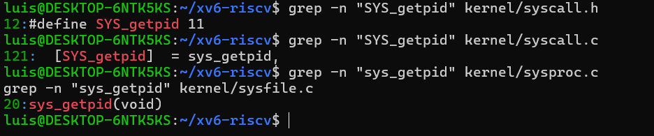
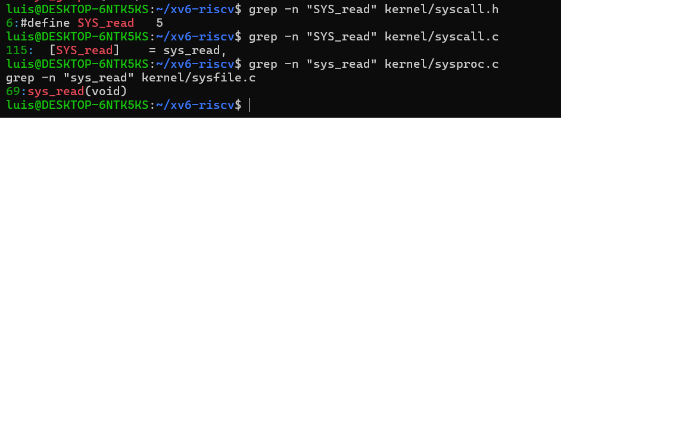
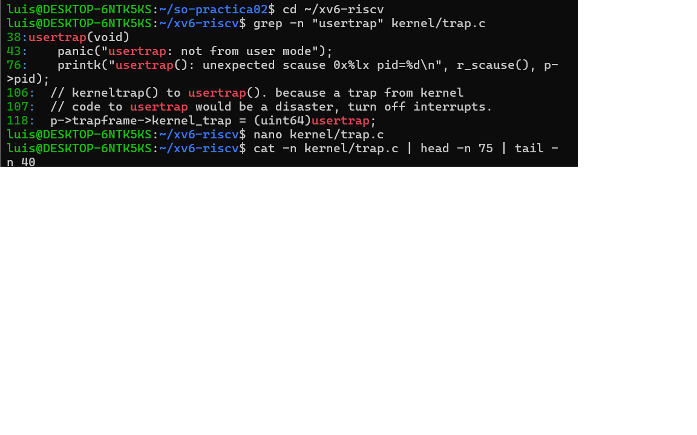
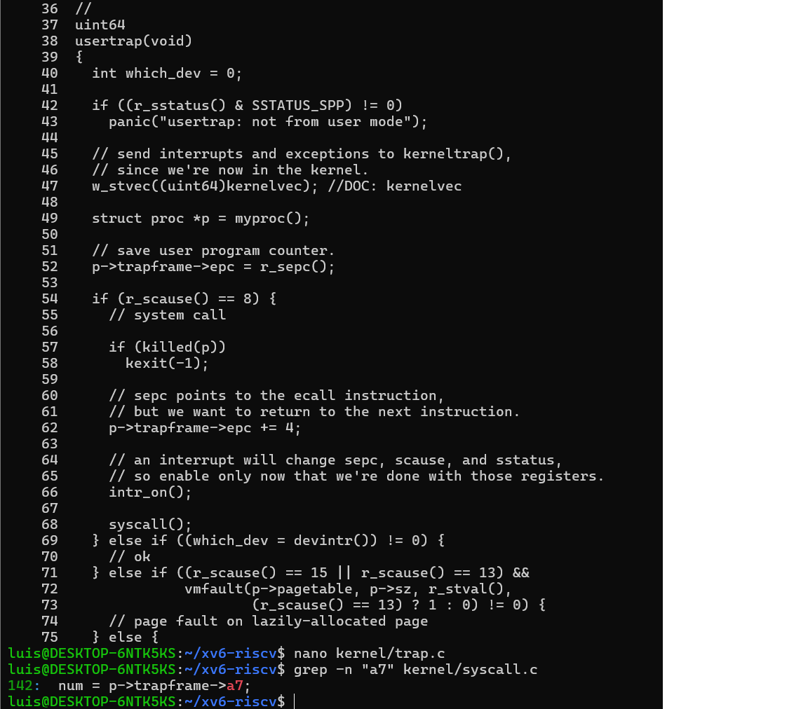

# Práctica 02 - xv6-riscv

## 1. Interfaz, tabla de despacho e implementación de dos llamadas al sistema nuevas

### 1.1. Llamada al sistema: getpid
Para la llamada al sistema getpid, la secuencia inicia en el archivo kernel/syscall.h, donde se define la constante #define SYS_getpid 11 como su número de interfaz. Este número es utilizado en kernel/syscall.c para mapear la llamada en el arreglo de la tabla de despacho mediante el elemento [SYS_getpid] sys_getpid. Finalmente, cuando se efectúa la llamada, la tabla redirige la ejecución hacia la función sys_getpid() localizada en kernel/sysproc.c, la cual obtiene y devuelve el identificador de proceso actual (myproc()->pid).

### 1.2. Llamada al sistema: read
En el caso de la llamada al sistema read, la secuencia se define mediante la constante #define SYS_read 5 en kernel/syscall.h, estableciendo así su número de interfaz. En kernel/syscall.c, esta posición se registra dentro del arreglo de la tabla de despacho como [SYS_read] sys_read. Al invocarse la llamada, el despacho redirige la instrucción hacia la función sys_read(), que se encuentra implementada en kernel/sysfile.c para realizar las operaciones de lectura directamente sobre el archivo o descriptor solicitado.

## 2. Investigación del mecanismo de trampa (trap)

### 2.1. Secuencia completa del camino de una llamada al sistema (getpid)

Desde que el programa de usuario invoca la llamada hasta que se ejecuta en el kernel, la secuencia sigue estos pasos:

1. **Ejecución de `ecall`:** El programa de usuario prepara el número identificador `#define SYS_getpid 11` en el registro `a7` del procesador y ejecuta la instrucción ensamblador `ecall`. Esto provoca una interrupción por software (trampa) que transfiere el control del procesador en modo usuario al modo kernel.
2. **Entrada a `usertrap()` (`kernel/trap.c`):** La trampa es capturada por la función `usertrap()`. En la **línea 54**, la condición `if(r_scause() == 8)` verifica que la causa de la trampa sea una llamada al sistema (*environment call* en RISC-V).
3. **Ajuste del PC e Invocación a `syscall()`:** En la línea 62 se incrementa el contador de programa (`p->trapframe->epc += 4`) para evitar reejecutar la instrucción `ecall` al retornar a usuario, y en la **línea 68** se efectúa la llamada a la función `syscall()`.
4. **Despacho e identificación en `syscall()` (`kernel/syscall.c`):** En la **línea 142**, la función `syscall()` lee el número de llamada mediante `num = p->trapframe->a7;`. Al identificar que `num` es `11` (`SYS_getpid`), utiliza dicho valor como índice en el arreglo de la tabla de despacho `syscalls[num]` para redirigir la ejecución a la función correspondiente.
5. **Ejecución en `sys_getpid()` (`kernel/sysproc.c`):** Finalmente, la función `sys_getpid()` se ejecuta dentro del kernel, recupera el identificador del proceso activo invocando `myproc()->pid` y coloca el resultado en el registro `a0` (`p->trapframe->a0`) para ser retornado al proceso de usuario.

### 2.2. ¿Qué es el "trapframe"?
